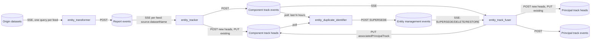

# crucible-entity-manager: design

| | |
|---|---|
| Status | Draft for review |
| Date | 2026-09-30 |
| Branch | `CRUC-5731_entity-keyed-state-architecture` |
| Behavioral baseline | crucible-streamlit `develop` at `1b534df` (PR #232 merge), `objectApps/correlators/entity_manager/` |
| Architectural baseline | crucible-streamlit `CRUC-5731-keyed-state-architecture`, `objectApps/correlators/correlator_core/` |
| Platform baseline | crucible-prototype `crucible-executor-ha-merge-dev3` at `f52ac0ed6e` |
| Review history | 2026-09-30: independent QC review by Codex (read-only, verified against source). All 11 findings accepted and incorporated: fuser pinned to one partition; D4 reworked from a timestamp rule to input-identity deduplication; recovery guarantee narrowed and the preload/stream handoff added; overlap hazards restated; D8 added for withheld events; per-key write ordering, payload chunking, eviction rules, the drain deadline and the carried-over CLI modes specified; test table corrected; Q3 closed. Same day: Q1 and Q2 answered by Chuck. SSE has no replay, which added D9 (gap logging and backfill) and reversed the rollout recommendation for the streaming components. Only Upsert accepts a pre-populated primary key, which opened Q4. Q4 answered: `write_record_batch_by_name` upserts on ENTITY datasets, so the proposed D10 was withdrawn. Second Codex pass found 9 more issues (3 critical); all were verified and resolved. Backfill was removed at Chuck's direction (D9 is now gap logging only). Rollout overlap is accepted (new D10). D4 identities were reworked, and an existing `reportIds` misalignment bug was found and fixed. All per-key state is bounded, using the unknown-key PUT-first path (D11). The drain is enforced by a write budget. The 30-day supersede lookback is documented. Third Codex pass found 6 issues (2 critical), all verified and resolved. D11 now classifies failed PUTs with an existence check instead of upserting them. The drain is enforced at process level with `os._exit`, because cruciblelib's sync client retries internally and httpx timeouts are not wall-clock limits. Association stamps are never created through the fallback. The identity accumulator is rehydrated from the principal head on an LRU miss. D4 adds a kinematic fingerprint. Summary wording now matches D10. Fourth Codex pass: 6 issues (1 critical), all verified. They were mostly residual effects of the accepted D10 overlap and are now stated explicitly rather than patched with more machinery. Also: D11's existence query fails closed and is chunked; the D4 fingerprint now covers the whole input apart from `crucibleHeader`; stamp retries are bounded; `os._exit` flushes logs and reports in-flight writes as uncertain. A fifth pass was stopped at its time limit, but its partial output found that an event-loop timer cannot enforce the hard deadline while inline CPU work blocks the loop. That timer now runs in a separate thread. The fifth pass, rerun to completion, found 3 specification blockers, all fixed. The owner loop now ticks every `--tick-seconds`, so retries and expiry run on an idle stream. Signals are handled by a `sigwait` watchdog thread, and the hard deadline writes its diagnostics with `os.write` before `os._exit`. Exit status is classified by write role. The assumption that hooks are deterministic is stated. The sixth pass confirmed the tick and hook-determinism fixes, and found that the stderr write could block and that the counters could be read mid-update. Both are fixed: stderr is non-blocking, and accounting is done through one count plus an atomically published snapshot. The seventh pass confirmed the stderr fix and found that the snapshot was published only after each change. The order is now fixed: increments are published before a write is submitted, decrements after it is confirmed, and the exit code is taken from that same snapshot. |

## 1. Purpose and scope

This repository rebuilds the Crucible entity correlation pipeline as a service that
runs on the Executor platform and nowhere else.

**Goals**

- Preserve the entity pipeline's observable behavior at `1b534df`, except where
  §10 records a deliberate change.
- Run each component as a disposable Kubernetes workload: state can be rebuilt,
  shutdown is bounded, and failures show up in Executor status and logs.
- Keep exactly one ordered owner per key, with bounded memory and bounded I/O
  concurrency.
- Type every module strictly and keep it free of dead code, compatibility shims
  and duplicate implementations.

**Non-goals**

- Object pipeline, Streamlit, legacy pandas hooks (API v1), and the StoneSoup
  tracker.
- Docker images or TRMC packaging. Executor clones this repository into a
  platform-built image (§3).
- Refactoring cruciblelib. It still carries legacy correlator copies and
  pandas, filterpy, stonesoup and scikit-learn dependencies. That clean-up is
  separate work.

## 2. The pipeline today (`1b534df`)



| Component | Input | State | Current parallelism | Output |
|---|---|---|---|---|
| Transformer | One SSE query per datafeed config | None; each record is transformed on its own | `number_of_transformer_processes` workers per feed, sharing one queue | Report events |
| Tracker | Report events for one origin feed | Kalman prior per `trackId`, known trackIds, pending head updates | `num_tracker_workers` shard processes per feed, routed by `md5(trackId)` | Component track events and heads |
| Fuser | All component track events, plus management events | Principal-track Kalman prior, component↔principal map, supersede map, fused identity | `num_fusion_workers` shard processes, routed by `md5(supersede root)` | Principal track events and heads, plus component-head associations |
| Duplicate identifier | Polls recent component track events and heads | Protected-ID set, refreshed each cycle | Single process | SUPERSEDE management events |

The design depends on these invariants from `1b534df`, and they are preserved:

1. **Deterministic identifiers.** Component `trackId = uuid5(NAMESPACE_DNS,
   "{origin_dataset}:{customID}")`, where `customID` is built from the configured
   identity paths (default `identity.*`). Principal `trackId = uuid5(NAMESPACE_DNS,
   "entity_principal_track:{supersede root}")`. Restarting a component recreates
   the same IDs without coordinating with anything.
2. **Heads before events.** A new head is created (POST) before any event that
   references it. If the head create fails, that cycle's events for the track
   are **dropped**, not buffered. The trackId stays marked as new, so the create
   is retried from the next batch that contains the track (decision D8).
3. **Best-effort head updates.** Updates to existing heads are rate-limited
   (`head_update_interval_seconds`), coalesced to the latest record per track, and
   written in the background. Events are the authoritative stream.
4. **Supersede semantics.** For each trackId the most recent management event
   wins. SUPERSEDE follows chains to the root, DELETE maps to `None`, RESTORE
   removes the entry, and cycles are cut.
5. **Identity fusion.** A principal track's identity is the union of non-null
   component identities. A superseded source outranks the survivor, and among
   sources of equal rank the most recent value wins.
6. **Filter guards.** Measurements older than the prior are skipped. A time jump
   of more than 15 minutes, a NaN state, or a covariance above 1e15 resets the
   filter.

## 3. Runtime platform: Executor

These facts were verified from source. `docs/runbook.md` will carry the
operational detail.

- **Code delivery.** An `alpine/git` init container runs
  `git clone --depth 1 --branch <b>` (optionally followed by `checkout <commit>`)
  into `/work/repo` every time a pod is created. The main container then runs
  `python3 /work/repo/<entrypoint> <args…>`. There is no install step, so every
  runtime dependency must already be in the profile image, which the team builds
  the same way as the JupyterHub image.
- **Profiles.** A profile is a generic runtime (image, environment, volumes),
  such as the `crucible-analytics` profile that is being renamed to something
  like `crucible-python`. It provides `CRUCIBLE_*` authentication variables and
  `PYTHONPATH=/work/repo`. Profiles come only from the Helm configmap.
- **Definitions** come from the configmap or from `POST
  /api/v2/executions/definitions`. The repo-file sync (`crucible-execution.yaml`)
  exists but nothing calls it. One definition can be started as many named
  Executions, each with its own `args` and `env`.
- **Workload types.**
  - A `JOB` is a k8s Job. `backoffLimit` defaults to 0, so a crash is terminal.
  - A `SERVICE` is a Deployment with `RestartPolicy=Always`. Stopping it scales
    it to 0. A rerun changes a pod-template annotation, which triggers a
    **RollingUpdate**: the new pod starts before the old one is terminated.
    The rollout strategy cannot be configured.
- **Gaps.**
  - The Go CRD and the operator support `template.resources`. The Spring API's
    `ExecutionTemplate` has no such field and ignores unknown fields, so
    definitions and profiles cannot set CPU or memory, and pods run as
    BestEffort.
  - Probes are attached only through `spec.service`, which requires ports and
    creates a ClusterIP Service.
  - The definition's `service` block is ignored in favor of the profile's.

Consequences for this design:

| Platform fact | Design response |
|---|---|
| Replicas are identical copies with no routing | Never scale with `replicas`. Partitions are separate Executions with distinct `--partition` args (§5.2). |
| Rollouts overlap old and new pods | Overlap behavior is accepted and documented: for a few seconds there are duplicate event rows and last-writer-wins head updates (D10). Within one pod, repeated inputs are dropped (D4). |
| Pods are recreated from scratch | State is always rebuilt from Crucible at startup (§5.4). |
| SIGTERM is followed by SIGKILL after the grace period (30 s default) | Shutdown is cooperative and time-bounded (§5.7). |
| No resource limits | Memory is bounded by design (queues, windows, caches) rather than by cgroups (§5.3). |
| No liveness probe without a Service | Health endpoint is optional and off by default, pending the platform change (§5.6). |
| Branch head is cloned on every pod creation | Production definitions pin `commit` (§7). |

## 4. Principles

1. **One owner per key.** A key's state lives in exactly one coroutine in
   exactly one pod. No locks, no shared mutable state.
2. **Bounded everything.** Input queues, write concurrency, preload size and
   history windows all have explicit limits that are logged at startup.
   Backpressure blocks the producer and never drops data silently.
3. **Records stay nested.** Records are processed as `dict` data typed with
   `JSONObject`, and NumPy is used only for dense numeric batches. No pandas.
4. **Pure core, thin shell.** Transform, filter and detection logic are pure
   functions or classes with no I/O. All Crucible access goes through one typed
   boundary package (`crucible/`).
5. **Validate once.** Configuration is parsed at startup into frozen dataclasses.
   Code past that boundary never checks config keys for existence or converts
   strings.
6. **One implementation per concept.** One Kalman core, one smoother, one
   geodesy module, one timestamp parser, one partition function.

## 5. Architecture

### 5.1 Process model

One pod runs one component for one partition, in a single Python process with a
single asyncio event loop.

```text
┌──────────────────────────── pod: entity-tracker-p0 ────────────────────────────┐
│  Source(s)                 Owner loop                    Sink                  │
│  SSE client ─► bounded ─►  filter owned keys ─► pure   ─► BatchWriter ─► Crucible
│  (reconnect,   asyncio     component logic      core     (bounded concurrency, │
│   watchdog)    Queue       (sole owner of state)          retry, failure report)│
│                                                                                │
│  Lifecycle: preload → run → drain on SIGTERM     Health: /healthz (optional)   │
└────────────────────────────────────────────────────────────────────────────────┘
```

- Crucible searches and writes call cruciblelib's synchronous v2 controller
  methods through `asyncio.to_thread`. A semaphore bounds how many run at once,
  and each request has a per-request timeout (§5.7). The async methods are not
  used: cruciblelib's async path re-raises failures as a bare `httpx.HTTPError`,
  losing the status and response body that error handling needs.
- CPU-bound work (Kalman batches, smoothing, KD-tree queries) runs inline in the
  owner loop, in bounded batches. A batch that runs too long delays I/O but can
  never corrupt state, and the health check measures the lag (§5.6).
- `multiprocessing` is not used anywhere. Scaling out means adding partitions
  (Executions).

### 5.2 Components and partitioning

Every component reads its full input stream and keeps only the records it owns:
`stable_shard(key) == partition.index`, where `stable_shard` is MD5 modulo
partition count (kept from `1b534df`). The cost is that each input stream is read
N times. That is acceptable at the current partition counts. A later optimization
would push the predicate into the SSE query if Crucible SQL supports it.

| Component | Workload | Partition key | Partitions | Notes |
|---|---|---|---|---|
| `transformer` | SERVICE | `crucibleHeader.uuid` of the source record | ≥ 1 | Stateless, so any stable key works. A record without one belongs to partition 0. Hosts all enabled feeds, or one feed via `--feed`. |
| `tracker` | SERVICE | Component `trackId` | ≥ 1 | Hosts all tracker-enabled feeds, or one feed via `--feed`. |
| `fuser` | SERVICE | none | exactly 1 | See below. Startup fails if `--partitions > 1`. |
| `duplicates` | SERVICE | none | exactly 1 | Global spatial comparison across feeds, so it cannot be partitioned. Startup fails if `--partitions > 1`. |

**Why the fuser is not partitioned.** Its natural key, the supersede root,
changes at runtime. At `1b534df` a single dispatcher applies each batch of
management events to the one supersede map before it routes the component events
in that batch, so the map and the routing stay consistent.

Independent pods would each consume the component and management streams
separately. At any moment they could disagree about `A → B`, and then both
would accept the same component event under different owners. A new owner also
isn't guaranteed to hold the root's prior: preload is limited, and principal
heads that have no component association are routed by a fallback hash.

Partitioning the fuser safely would need two things: one ordered stream carrying
both event kinds, and an explicit handoff of ownership. Neither exists, so the
fuser runs as one partition (decision D3). That limits it to one core, whereas
`1b534df` could use up to `num_fusion_workers` cores (default 4). The work per
event is one 6×6 filter update. If the fuser becomes a bottleneck, profile it
before bringing partitioning back.

### 5.3 Data flow and backpressure inside a pod

1. **Source.** `SseSource` connects, refreshes the token before each connect,
   and parses each payload once. It filters the payload to owned keys, splits
   what remains into chunks of at most `max_batch_records`, and `await`s
   `queue.put(chunk)` for each chunk.
   - The queue is bounded by record count, not payload count, so one oversized
     snapshot cannot occupy the whole memory budget as a single queue item.
   - When the queue is full, the reader stops reading, which propagates as TCP
     backpressure.
   - At `1b534df`, `put_to_queue` **drops** the payload after a 0.1 s timeout.
     That becomes blocking backpressure here (decision D1).
   - The watchdog (`CRUCIBLE_SSE_READ_TIMEOUT`, default 180 s), the read buffer
     and exponential backoff with jitter are kept.
   - The read buffer stays at 256 MB. It bounds one raw payload, and memory in
     that case is dominated by the single parse of that payload.
2. **Owner loop.** Waits for a chunk for at most `--tick-seconds` (default 5).
   It then drains further chunks up to `max_batch_records` and runs the
   component's pure step. The step returns a typed `WritePlan`: head creates,
   events, best-effort head updates and association updates.

   **Every iteration also runs the timed work, whether or not input arrived.**
   That timed work is:
   - retrying failed head PUTs and existence checks (D11);
   - releasing withheld events (D8);
   - retrying association stamps;
   - age-based expiry and the D2 idle eviction.

   So when the input stream goes quiet after a transient failure, pending work
   still completes or expires. A test covers an idle stream after a transient
   write failure.
3. **Sink.** `BatchWriter` executes the plan in the §2 order:
   - Head creates are awaited before events are written.
   - **Events keep their order per key.** The plan splits events into waves with
     at most one event per key in each wave, as the tracker does at `1b534df`.
     Each wave is awaited before the next one starts. Within a wave, chunks are
     written concurrently up to the concurrency bound.
   - Best-effort head updates go to a single background task. While that task is
     in flight, newer updates are coalesced into its pending buffer. This keeps
     the "at most one in flight" behavior from `1b534df`, now as one object
     instead of three copies.
   - Each key's update is sent at most once per `head_update_interval_seconds`,
     as at `1b534df`. An update that arrives within the interval is **deferred**
     and sent when the interval has passed; the baseline dropped it, so a track
     that went quiet kept an older head (§8).

Memory is bounded by explicit limits, and each one is logged at startup:

- Queued records, set by `source_queue_max_records`.
- Batch size, set by `max_batch_records`.
- The preload limit (`CRUCIBLE_HEAD_PRELOAD_LIMIT`, default 100,000).
- The duplicate-identifier history window and row limit.
- Per-key state, under the caps below.

Per-key state is never evicted at `1b534df`. Here every kind of per-key state has
a bound (decision D2):

| State | Bound | What happens at the bound |
|---|---|---|
| Kalman prior | Evicted after 30 min idle (twice the reset horizon). A global LRU cap, `max_tracked_keys` (default 200,000), also applies. | The next measurement starts a fresh prior, exactly as a reset does. |
| Fused identity accumulator (fuser) | No idle expiry. Only the LRU cap applies. | On a miss, the accumulator is rehydrated from the stored principal head's `identity.*` fields. The precedence ranks (superseded over survivor) are not stored, so they restart at the survivor rank. Because head updates are best-effort, the stored identity can also be slightly stale. After rehydration, a survivor's value can therefore replace a value that previously outranked it. This only happens past the LRU cap, which is far above normal track counts. It is accepted (D2), documented and tested. A restart at `1b534df` loses the whole accumulator. |
| Known-trackId set (tracker), component↔principal associations (fuser) | The same LRU cap, and the same 30 min idle expiry. | The key becomes *unknown* and its head goes through the unknown-key path below, which is safe for heads that already exist. |
| Applied-input identities (D4) | The last 64 per key, evicted with the key. | An older duplicate is fused again. This window is far wider than any rollout overlap. |
| Pending best-effort head updates | One per key, plus a global cap of `max_pending_head_updates` (default 50,000). | The oldest pending updates are dropped and counted. Heads are best-effort by design (invariant 3). |
| Withheld events (D8) | 100 per key, plus a global cap of 10,000. | The oldest are dropped and counted. |
| Pending association stamps (fuser) | One per component track, a global cap of 50,000, and a maximum age of 1 h. | Stamps that hit the cap or the age limit are dropped and counted. A dropped stamp only affects the next restart's preload (§5.4), and the next event for that component track stamps it again. |

**Unknown-key head path.** At `1b534df` a key that isn't in the known set gets a
full-record create. On a head dataset that create is an upsert, so if the head
already exists it **overwrites** fields owned by another writer. The clearest
case is `associatedPrincipalTrack`, which the fuser stamps on component heads.
That already happens today when the head preload is truncated (§5.4).

Here, the head for an unknown key is written with PUT first. PUT is partial and
preserves fields set by other writers. The PUT returns failed records without a
reason code: a failure can mean either "not found" or "failed validation". So
**failed IDs are classified before anything is created**:

1. Read queries fetch which of the failed IDs exist (`SELECT trackId …
   WHERE trackId IN (…)`), in chunks of at most 200 IDs. The IDs are 32-character
   lowercase hex, and each one is validated against that pattern before it is
   placed in the query.
2. IDs that don't exist are created with `write_record_batch_by_name`.
3. IDs that do exist failed validation. They are logged with the server's
   response and are **not** upserted. Their events are withheld (D8), and the PUT
   is retried on the next cycle.
4. **Fail closed.** If an existence query fails, nothing is created for the IDs
   in that chunk. Their events are withheld (D8) and the whole sequence is
   retried on the next cycle. A failed read is never treated as "missing".
5. A key's events are released only after its PUT or create has succeeded
   (invariant 2).

This makes the known-ID sets a cache that can be evicted safely, and it fixes the
overwrite after a truncated preload. The cost is one extra round trip for a
genuinely new track, plus the existence queries whenever a PUT fails (D11).

**What D11 does not cover.** Crucible has no atomic create-if-absent operation.
Each head dataset has a single creator: the tracker for component heads (one
partition per trackId) and the fuser for principal heads (one partition). So
the window between the existence check and the create only matters when a
*second* creator is running, and that happens only during D10 rollout overlap.
In that window a stamp written in between can still be overwritten. This is
part of the accepted overlap behavior (D10).

### 5.4 State and recovery

State is rebuilt from Crucible on startup. That is a **best-effort** recovery,
not an exact one. Updates to existing heads are deliberately best-effort
(invariant 3), so a restarted pod can resume from a head that is older than the
last state it actually computed. The recovery guarantee is: *the pod resumes from
the last head update that was successfully written, and the error from any
stale prior decays with the next measurements.* This is the same guarantee
`1b534df` gives.

Recovery then proceeds per component:

- **Tracker.** Preloads component heads (newest first, limited). For each head it
  restores the prior (state, covariance, `trackUpdatedTimestamp`) and marks the
  trackId as known. Heads whose `trackId` doesn't match the feed's deterministic
  ID are skipped, as at `1b534df`.
- **Fuser.**
  1. Loads the supersede map from paginated management events, with the same
     lookback as `1b534df` (`--management-lookback-days`, default 30). See
     *Supersede map after a gap* below.
  2. Preloads principal heads and the component heads that carry
     `associatedPrincipalTrack`.
- **Duplicate identifier.** Rebuilds its protected-ID set on every cycle already.
- **Transformer.** Stateless.

If a preload hits its limit, the pod logs a warning, as today. The consequence of
truncation is bounded: a track whose head was dropped starts from its next
measurement with a fresh prior. Its deterministic ID means no orphan is created.

`skip_head_preload` is kept.

**Stream gaps.** Crucible SSE has no replay (Q1). A reconnect resumes at the
current moment, so every disconnect is a data gap:

- watchdog reconnects;
- network errors;
- pod restarts.

The data in a gap is lost, as it is at `1b534df`. There, only the cause of each
reconnect is logged. Here every gap is accounted for (decision D9):

- `SseSource` logs every gap as one structured WARNING naming the source, the
  time of the last received event, the time of resubscription, and the duration.
- On startup, each source logs its subscription time.
- No backfill is attempted.

**Supersede map after a gap.** The supersede map is state, not stream data. When
the fuser's management stream reconnects, the fuser reloads the whole map with
a paginated query. The reload uses the same lookback as `1b534df`, which is
`--management-lookback-days` (default 30). A SUPERSEDE older than the lookback
that is still in effect is therefore missing after a restart or reconnect. This
limitation is kept for parity and documented. Raising the lookback trades
startup time for completeness.

The duplicate identifier polls a time window, so it has no stream gap.

### 5.5 Write semantics and overlap safety

| Write | Method | Effect of a duplicate (rollout overlap or retry) |
|---|---|---|
| Report event | POST (append) | A second report row for the same origin record, for example from two overlapping transformer pods. At `1b534df` it is fused a second time, and the covariance becomes overconfident. **Change:** the tracker drops inputs it has already applied (D4, below). |
| Component track event | POST (append) | A duplicate event row. The fuser drops inputs it has already applied (D4). |
| Principal track event | POST (append) | A duplicate event row. There is no downstream consumer in this service. |
| New head | PUT first, then `write_record_batch_by_name` for IDs confirmed missing (D11) | Idempotent. On ENTITY datasets this endpoint performs an **upsert** (Q2/Q4, answered). Head IDs are deterministic, so two pods creating the same head write the same key, and the last write wins. |
| Existing head, association | PUT (`update_entity_record_batch_by_name`), best-effort | Idempotent, and a later write wins. PUT is partial, so the fused identity already on the server is preserved (see the comment at `entity_track_fuser.py:966`). At `1b534df` a failed update is only logged; `write_entity_updates_with_create_fallback` exists but is never called. Here, a key whose update fails is dropped from the known set, so its next write goes through the D11 path and the head is recreated if it is missing. **Association stamps** (`trackId` plus `associatedPrincipalTrack` only) never take the D11 path: a sparse upsert would create an incomplete head. A failed stamp stays pending and is retried each cycle until the tracker has created the component head (`entity_track_fuser.py:129-184`). |
| SUPERSEDE | POST (append) | Usually harmless, since the map takes the most recent event per trackId. **Not safe in general**, for two reasons. First, the protected-ID set is local to the process, so two overlapping detectors can both emit. Second, the survivor is chosen from a head snapshot limited to 10,000 rows, so two runs can choose differently. A SUPERSEDE that lands after an operator's RESTORE also undoes that RESTORE. |

**Input identity (D4).** Each filter remembers which inputs it has already
applied, using these keys:

| Component | Input identity | Source of the fields |
|---|---|---|
| Tracker | `(trackId, source.uuid, kinematicsTimestamp, fingerprint)` | `source.uuid` is the origin record's `crucibleHeader.uuid`, copied by the transformer when present (`entity_transformer.py:190-193`). |
| Fuser | `(component trackId, interceptTimestamp, reportIds, fingerprint)` | `reportIds` is set by the tracker from the report's `source.uuid` (`entity_tracker.py:1504-1506`). |

- **Fingerprint.** `fingerprint` is the SHA-256 of the input record with
  `crucibleHeader` removed, serialized as JSON with sorted keys and compact
  separators. Floats are serialized with Python's shortest round-trip `repr`.
  Any change that matters, whether to kinematics, identity or environment,
  therefore changes the fingerprint.

  The built-in transformer steps are deterministic for a given origin record and
  configuration, and customer hooks are *assumed* to be deterministic too (§5.9).
  Under that assumption, two transformer pods writing the same report produce identical
  content apart from `crucibleHeader`, and the second copy is dropped. A test
  round-trips records through JSON and compaction to confirm the fingerprint is
  stable.
- **What D4 does not cover.** Two overlapping *tracker* pods can produce
  different component events from the same report, because their priors differ.
  Likewise, a non-deterministic customer hook makes two transformer pods
  produce different reports for the same origin record.
  Those events have different fingerprints, and the fuser fuses both. This is
  part of the accepted overlap behavior (D10).
- **Missing fields.** Inputs without the identity fields (no `source.uuid`, no
  `reportIds`) bypass the filter. Each batch logs how many did.
- **Equal timestamps.** Distinct inputs that share a timestamp, such as two
  component tracks in one supersede group, are both fused.
- **Scope.** D4 works within one pod. It removes repeats that the pod sees. It
  does not reconcile two pods of the same component (next paragraph).

**Identity travels with the output.** Each pure step returns outputs paired with
the index of the input that produced them. At `1b534df` the tracker pairs Kalman
outputs with inputs using `zip` (`entity_tracker.py:1502`). Any row skipped for a
NaN measurement shifts every later pairing, so those track events carry the
**wrong `reportIds`**. That bug is fixed here and covered by a regression test.

**Rollout overlap (decision D10).** During a RollingUpdate of a streaming
component (transformer, tracker or fuser), the old and new pods run together
for a few seconds, each with its own state. During that window:

- both pods write event rows, so append-only event datasets receive duplicate,
  and possibly slightly different, rows;
- both pods update the same heads, and the last write wins;
- after the old pod exits, each head converges on the surviving pod's next update to it. A track with no further input keeps whichever pod wrote last, which is a valid recent state.

This is **accepted and documented** as expected rollout behavior. Preventing it
would need fencing (a single active writer, for example a k8s Lease), which
requires platform RBAC and a leader-election subsystem, and is out of scope.
The overlap also has an upside: it keeps data flowing during a rollout, whereas
`Recreate` would add a gap (§5.4).

The duplicate identifier is the exception. Its SUPERSEDE writes race, and
because it polls a window, `Recreate` costs it nothing. For the duplicate
identifier:

- **Platform ask 3.** A rollout strategy that can be set per definition:
  `Recreate` for the duplicate identifier, RollingUpdate for the rest.
- **Deterministic survivor choice.** The survivor is chosen from the two
  candidates' own heads, fetched by trackId, rather than from a limited
  snapshot.
- **Re-check before each write.** The detector re-reads the protected IDs
  immediately before each SUPERSEDE write. It skips the pair if the track to
  supersede is now protected, or if the survivor has since been superseded,
  deleted or restored; a survivor may survive several tracks. The writes of
  the current poll count as protected even before a search shows them. This
  narrows the race but does not remove it.
- **Tests.** Concurrent detector runs, and RESTORE-versus-SUPERSEDE ordering.


### 5.6 Health

`--health-port` (off by default) serves `GET /healthz` using aiohttp, which is
already a dependency. It returns 200 when both of these hold:

- The owner loop has made progress within `--stall-seconds` (default 300)
  whenever it holds a batch or input is waiting.
- Every SSE source has received an event or keep-alive, or connected, within
  its watchdog window. The window is counted from no earlier than the end of
  preload.

During preload the check reports healthy, so a probe cannot kill a pod that
is still rebuilding state. Preload is made of bounded, timed-out reads.

Otherwise it returns 503 with a JSON body describing the failure. This covers
the known failure mode where a pod is alive but no longer processing because its
SSE stream stalled. It becomes useful once Executor allows a liveness probe
without a Service. Until then the SSE watchdog's reconnect is the mitigation.

### 5.7 Lifecycle and shutdown

`Service.run()` performs these steps:

1. Parse CLI and environment into `RuntimeSettings`.
2. Authenticate, load the perspective configuration (§5.8), and load hooks
   (transformer only).
3. Preload state, then start the sources, the owner loop and the health server
   as tasks in one `asyncio.TaskGroup`.
4. On SIGTERM or SIGINT, stop the sources, let the owner loop finish its current
   batch, and flush the writer, all within `--drain-seconds` (default 20, below
   the 30 s grace period).

A thread running a synchronous call cannot be cancelled. cruciblelib's write
client also retries connections internally
(`httpx.HTTPTransport(retries=3)`, `controllers/v2/controller.py:184-187`). And
httpx timeouts limit individual phases or periods of inactivity, not the total
duration. So no timeout setting can guarantee that a write thread finishes. The
deadline is therefore enforced at the process level:

- **Budget check.** No new write request is started once the remaining drain
  budget is below `--request-timeout` (default 15 s). The budget's deadline is
  the watchdog's: `--drain-seconds` after the signal arrived, not after the
  event loop noticed it. Retries and the sub-chunk
  fallback stop at the same point. This prevents new work but doesn't stop work
  already in flight.
- **Async reads** are cancelled at the deadline.
- **Signal handling independent of the event loop.** At startup, before any other
  thread exists, the main thread blocks SIGTERM and SIGINT with
  `signal.pthread_sigmask`. Threads created later inherit that mask, including
  `asyncio.to_thread` workers. A dedicated daemon *watchdog thread* waits for
  the signals with `signal.sigwait`.

  When a signal arrives, the watchdog (a) asks the event loop to start the
  graceful drain with `loop.call_soon_threadsafe`, and (b) starts timing the
  hard deadline itself. Neither step depends on the event loop or the main
  thread being responsive, so inline CPU work (§5.1) cannot delay either.
- **Graceful drain.** On the event loop: stop the sources, finish the current
  batch, flush the writer, log a summary through `logging`, and exit normally.
  If this completes in time, the watchdog never acts.
- **Hard deadline.** If the process is still alive at `--drain-seconds`, the
  watchdog builds a fixed-size summary. The summary covers writes still in
  flight or unwritten, counted per dataset and split by write class. Writes
  still in flight are marked **uncertain**, because the server may already have
  committed them.

  The watchdog switches stderr (file descriptor 2) to non-blocking mode with
  `os.set_blocking(2, False)`. It then writes the summary with a single
  `os.write`, ignoring `BlockingIOError` and partial writes, so a full stderr
  pipe can cost the diagnostics but never delays the exit. It bypasses `logging`
  and its handlers, which could block. It then calls `os._exit` without joining
  any thread.
- **Coherent accounting.** A single immutable snapshot decides both the
  diagnostics and the exit code. Per dataset, it holds the authoritative
  records that are *outstanding* (submitted, outcome unknown, including writes
  interrupted by cancellation) and those *lost* (failed or refused after
  draining began). The exit code is 1 unless both are empty. The event loop replaces it
  with one reference assignment, which is atomic in CPython. The watchdog reads
  that one reference and nothing else.

  The order of publication makes the snapshot err on the safe side:
  - A new snapshot that **adds** a write is published *before* the write is
    handed to the writer.
  - A snapshot that **removes** a write is published only *after* the server
    has confirmed it.

  So a published snapshot can over-count outstanding writes but can never
  under-count them. At worst the exit code is a conservative 1; it can never be
  a false 0.
- **Exit status** depends on the class of write that was left unwritten or
  uncertain:

  | Class | Writes | Exit code if any are left unwritten or uncertain |
  |---|---|---|
  | Authoritative | Event writes. The D11 sequence for unknown keys (PUT, existence check, create). Initial head creates. | **1** |
  | Best-effort | Updates to known heads (invariant 3). Association stamps. | No effect (0) |
- **Test.** Run in a subprocess: shutdown during a request that never returns.
  The process must exit within `--drain-seconds` with code 1, and the final
  diagnostic lines must appear in its captured stderr.

`1b534df` used a 120 s read timeout on write controllers. That becomes
`--request-timeout`, applied as the httpx read timeout.

An unhandled exception in any task cancels the group and the process exits
non-zero, so the Deployment restarts the pod.

Details fixed during implementation:

- A signal during startup or preload cancels it. These steps only read, so
  nothing is written, and the exit code comes from the ledger.
- Records still in the queue when draining begins are not processed. Their
  count is logged. Like an SSE gap, they are not recoverable.
- The event loop is never closed, and the process ends with `os._exit` after
  logging is flushed. Closing the loop or exiting normally would join worker
  threads, and a thread blocked in a write may never return.

**Removed:** `terminate()` killed the whole process group with SIGKILL on
SIGTERM, which lost any batch in flight.

### 5.8 Configuration

There are three sources, each with one job:

| Source | Contents | Parsed into |
|---|---|---|
| CLI args (Execution `args`) | component, perspective, `--partition`, `--partitions`, `--feed`, `--log-level`, `--health-port`, `--drain-seconds`, `--request-timeout`, `--tick-seconds`, `--management-lookback-days`, and the per-component options listed below | `RuntimeSettings` plus a per-component options dataclass |
| Environment (profile) | `CRUCIBLE_*` auth and endpoints, `CRUCIBLE_SSE_*` tuning, `CRUCIBLE_SSL_VERIFY` | `CrucibleSettings` |
| Crucible `Entity_Stream_Manager_Configurations` (rows for the perspective) | Perspective row (dataset names, batch sizes, intervals) plus one row per datafeed (query, mappings, tracker mode, hooks) | `PerspectiveConfig` and `FeedConfig` frozen dataclasses |

The validation rules that exist at `1b534df` all stay. They reject configurations
with:

- duplicate destination columns;
- no `identity.*` destination;
- a missing required dataset key;
- more than one focus flag. Both the `disable_all_other_datasets` spelling and
  the legacy `disable_all_other_datsets` spelling are still accepted.

**Changed:** Crucible returns config values as strings, and they are converted
exactly once, when the config is loaded. A validation error names the row and
the key, and the process exits non-zero at startup, which shows up as a Failed
Execution. At `1b534df`, a missing mapping only logged a warning and slept for
5 s.

Parallelism settings no longer come from Crucible configuration. The keys
`number_of_transformer_processes`, `num_tracker_workers` and `num_fusion_workers`
are ignored with a warning that points to `--partitions` (decision D5).
Parallelism is a deployment concern.

**Per-component options** keep the command-line flags that exist at
`1b534df`, with the same defaults, so no operating mode disappears:

| Component | Options |
|---|---|
| Fuser | `--no-ci` (CI is the default), `--ci-omega`, `--passthrough` |
| Duplicates | `--poll-interval` (30), `--distance-threshold` (500 m), `--mahalanobis-threshold` (3.0), `--velocity-threshold` (10 m/s), `--time-window-hours` (1.0), `--min-matching-points` (5), `--time-alignment-seconds` (5), `--min-confidence` (0.5) |

The duplicate detector's per-environment `DetectionParams` table stays in code,
and those CLI values remain its fallback, as they are today.

The tracker mode (`crucible_tracker`) is parsed into `TrackerMode`:
`SKIP`, `PASSTHROUGH`, `KALMAN`, `KALMAN_CI` or `UNRECOGNIZED`. The rules are
those of `1b534df`, with three changes:

- `ecef` selects Kalman again (§8).
- `3rd-party` and `third-party` also mean skip.
- The tracker rejects an `UNRECOGNIZED` value at startup. At `1b534df` it logged
  a warning on every batch.

**Other differences from `1b534df` in configuration handling**, all in
`config/perspective.py`:

| Area | `1b534df` | Now |
|---|---|---|
| Perspective rows | The last one found wins | Exactly one is required |
| `disabled` | Only the JSON boolean `true` disables a feed | Any boolean or boolean string (`"true"`, `"yes"`, …), the same rule as the focus flags |
| Validation of disabled feeds | Their mappings are validated anyway, and can fail startup | Disabled feeds are not validated |
| Identity mapping check | A destination *containing* `identity.` | A destination *starting with* `identity.` |
| Missing `origin_to_destination_mapping` | Warning and a 5 s sleep, then a crash | `ConfigError` naming the feed |
| Invalid numbers and booleans | Silently replaced by the default | `ConfigError` naming the row and key |
| Feed-level hook script names that conflict with the perspective | Error logged, then the last one wins | `ConfigError` |
| Hook script or function missing | Warning on every batch | `HookError` at startup |
| Source queue bound | `source_queue_max_batches` (payload count) | `source_queue_max_records` (default 50,000); the old keys are reported as ignored |
| The same `origin_dataset` on two feeds | Not checked | `ConfigError` |
| Configuration row passed to record hooks | One mutable dict, shared by every batch | A fresh deep copy per call, so changes a hook makes do not persist |

### 5.9 Customer hooks

Hook source code is stored in the `Entity_Stream_Manager_Functions` dataset and
executed in memory. This stays a product feature, with an explicit contract in
`hooks/`:

```python
type RecordHook = Callable[[list[JSONObject], Mapping[str, JSONValue]], list[JSONObject]]
type ValueHook = Callable[[JSONValue], JSONValue]
```

A record hook receives a fresh deep copy of the feed's merged configuration row
on every call. Existing customer hooks expect that row as a dict (they call
`.get()` on it), so it is not replaced by `FeedConfig`. Because each call gets
its own copy, nothing a hook changes persists into later batches.

- Only the v2 record contract is supported. `custom_function_api_version` or
  `hook_api_version` values other than `2`, `native` or `records` are rejected at
  startup, as at `1b534df`.
- Hooks are loaded once per process, when configuration is loaded. At
  `1b534df`, the source was also copied into every worker's config so that
  spawned processes could reload it. Without spawned processes that copy is no
  longer needed.
- Hook results are validated (`list[dict]`), and records are deep-copied at the
  boundary.
- A hook failure is logged with the feed and function name, and the batch
  continues without that hook, as at `1b534df`.
- **Determinism:** a hook must be a pure function of its input batch and the
  feed config. No clocks, no randomness, no external calls. D4's duplicate
  filtering during rollout overlap depends on it (§5.5). This is documented in
  the hook contract, but can't be enforced.
- **Trust boundary:** anyone who can write that dataset can run code in the pod.
  This is inherent in the feature and is documented, not changed.

### 5.10 Crucible boundary (`crucible/`)

- **Clients.** Thin typed async wrappers around the cruciblelib v2
  `ReadController` and `WriteController`. cruciblelib ships `py.typed` and
  stubs. The authenticator is passed as `token_provider`. `BaseController`
  refreshes the token within 60 s of expiry before each request
  (`_ensure_fresh_token`), which replaces the per-call `token_refresher`
  lambdas. An integration test with a short-lived token covers this. Timeouts
  come from one `TimeoutConfig`.
- **SseSource.** The hardened listener from `1b534df`, rewritten as a class with
  injected dependencies. It exposes `async for chunk in source`, and a fake
  source is used in tests.
  - Transport stays on aiohttp over HTTP/1.1, as proven against Crucible in
    production. The SSE framing is parsed in `sse.py` rather than by
    `aiohttp-sse-client`, whose `EventSource` reconnects internally with the
    original headers. That would bypass token refresh and gap accounting.
    cruciblelib's `stream_sse` was not adopted: it uses HTTP/2, which has not
    been tried against Crucible's SSE endpoint. Revisit this on the first
    Executor run; the planned spike against dev3 could not be done from the
    development environment.
- **BatchWriter.** Chunking, bounded concurrency, and the failure contract from
  `1b534df`:
  - POST returns a status code.
  - PUT with `include_failed_records=True` returns the records that failed.
  - A timeout gets one retry.
  - A 401 or 403 fails the chunk.
  - Any other error falls back to sub-chunks of `min(50, chunk_size // 4)`.

  The response mode is an enum rather than a string.
- **Management.** `build_supersede_map`, `apply_management_events`,
  `fetch_management_events` (paginated) and `duplicate_protected_ids`. At
  `1b534df` the map-building code exists twice, in `entity_utils` and in the
  fuser. This consolidates it into one implementation.

### 5.11 Numerics (`core/`)

| Module | Replaces | Notes |
|---|---|---|
| `kalman.py` | The tracker's `KalmanFilterManager`, `NumpyKalmanFilterManager` and in-file StoneSoup shims, and the fuser's `EntityPrincipalTrackFilter` math | Numeric primitives only: the constant-velocity model, `predict`, the standard (non-Joseph) `update`, and `covariance_intersection` with a `CiObjective` (full trace for the tracker, position trace for the fuser, D6). The stale-measurement and reset guards stay with each component. One deliberate difference: when some ω candidates have singular information, CI now skips those candidates for both components. At `1b534df` the tracker skipped them, but the fuser gave up on CI for that update. |
| `smoother.py` | `track_smoother.py` (filterpy) | A NumPy forward filter plus RTS backward pass, with the same gap segmentation and filterpy's Joseph-form update. It returns its times together with its states (§8). Input is sorted stably, so tied timestamps keep their input order; the baseline's sort was not stable. |
| `geodesy.py` | The ECEF/WGS84 math in `entity_transformer_records.py` | Batched geodetic↔ECEF conversion, the ENU→ECEF rotation, and 95% ellipse→covariance, plus the two record enrichers. The enrichers modify records in place and return `None`, so the fuser's discarded-copy bug (§8) can't recur. The eight rotation and ellipse helpers in `entity_utils.py` are dead code at `1b534df` and are not ported, which removes the only use of filterpy's `covariance_ellipse`. Geodetic angles are written in radians (§8). |
| `identity.py` | `canonical_identity_value`, `identity_custom_id`, `assign_track_id` | Same canonicalization rules, including JSON-integer preservation, whole-float normalization, and dropping missing or non-finite values. |
| `records.py` | `entity_transformer_records.py` and 5731's `nested.py` | `get_path`, `set_path`, `remove_path`, `clone`, `compact`, `parse_records`, typed with `JSONValue`. |
| `timeutil.py` | Five timestamp parsers that mix naive `utcnow()` and aware datetimes | Every datetime is timezone-aware UTC. One parser and one formatter. |
| `partition.py` | `stable_shard` and three `_shard_for_*` wrappers | `PartitionSpec(index, count)` with an `owns(key)` method. |

Duplicate detection keeps `scipy.spatial.cKDTree` for candidate search.

**Known inconsistencies at `1b534df`.** The tracker and fuser filters use
different process-noise tables:

| Setting | Tracker | Fuser |
|---|---|---|
| `SEA_SUBSURFACE` | 0.1 | 0.5 |
| `UNKNOWN` | 3.0 | 5.0 |
| Default q | 3.0 | 0.5 |

Their covariance-intersection objectives also differ: the tracker minimizes the
full trace, the fuser only the position trace. The single core makes these
explicit parameters, with each component's values preserved (decision D6), so
any change is deliberate.

**Differences from `1b534df` at the Crucible boundary** (`crucible/`):

| Area | `1b534df` | Now |
|---|---|---|
| Error types | Callers inspect `status_code` and `original_exception` on cruciblelib exceptions | `client.py` maps failures to `TransientError` (no response, or 504), `AuthorizationError` (401/403) or `RequestError` (status and body kept) |
| Management event reads | Any query error ends paging and returns the events read so far, and `get_supersede_map` turns other errors into an empty map | A 400 on the **first** page means "empty dataset", as the baseline assumed; the body is logged because its exact form isn't known. Any other error, including a 400 on a later page, raises, because a partial or empty map would misroute tracks |
| Duplicate-identifier protection | A map read failure gives an empty protected set | A map read failure raises, so that detection cycle is skipped and retried. A failure reading recent RESTOREs still only drops the cooldown protection |
| Dataset names in SQL | Interpolated as given | Must be plain identifiers (`[A-Za-z_][A-Za-z0-9_]*`); string values are quoted |
| Empty `supersededBy` | Treated as a target named `""` | Treated as a deletion, the same as a missing value |
| SSE query parameter | The SQL is appended to the URL unencoded | The SQL is sent as an encoded `query` parameter (§5.10) |
| SSE keep-alives | Comment lines are ignored, so a quiet but healthy stream is reconnected every 180 s; each reconnect is a gap | Keep-alive comments count as activity for the watchdog and the health check |
| SSE subscription | `EventSource` also reconnects internally with the original headers; a 200 with another content type is rejected | Every reconnect goes through one loop that refreshes the token and accounts for gaps. Connecting is time-limited until the response headers arrive. A non-event-stream response is still rejected |

## 6. Package layout

```text
src/
├── run_entity_manager.py          # Executor entrypoint. Python puts src/ on sys.path.
└── crucible_entity_manager/
    ├── __main__.py                # python -m crucible_entity_manager (local runs)
    ├── cli.py                     # argument parsing → RuntimeSettings → Service
    ├── config/
    │   ├── runtime.py             # RuntimeSettings and per-component options (CLI)
    │   └── perspective.py         # PerspectiveConfig, FeedConfig, TrackerMode, loader and validation
    ├── core/                      # pure; no I/O, no cruciblelib imports
    │   ├── records.py  timeutil.py  identity.py  partition.py
    │   ├── geodesy.py  kalman.py  smoother.py
    │   └── aliases.py             # JSONValue, JSONObject, FloatArray type aliases
    ├── crucible/                  # the only package that imports cruciblelib
    │   ├── client.py  sse.py  writer.py  management.py
    │   └── protocols.py           # structural types for fakes in tests
    ├── hooks/
    │   └── loader.py              # dataset → validated RecordHook/ValueHook
    ├── runtime/
    │   ├── process.py             # signal mask, watchdog, event loop, exit code
    │   ├── context.py             # bootstrap: client, perspective config → Context
    │   ├── service.py             # preload, sources → queue → owner loop, tick, drain
    │   ├── queue.py               # RecordQueue (bounded by records) and the source feeder
    │   ├── shutdown.py            # ShutdownWatchdog, deadline summary, exit codes
    │   └── health.py              # HealthMonitor and the /healthz server
    └── components/
        ├── base.py                # Component, Subscription, RecordSource, Services protocols
        ├── keyed.py               # KeyedState (idle + LRU bounds), D4 fingerprint and window
        ├── heads.py               # HeadSync: D11 head path, D8 withheld events, best-effort updates
        ├── tracking.py            # tracker filter policy: noise tables, guards, track rows
        ├── fusion.py              # fuser filter policy (D6), identity fusion, principal rows
        ├── detection.py           # duplicate detection: histories, k-d tree, evaluation
        ├── transformer.py
        ├── tracker.py
        ├── fuser.py               # associations, supersede handling, stamps, rehydration
        └── duplicates.py          # polling, survivor choice, protected-ID re-check, SUPERSEDE
```

`runtime/` is new relative to the scaffold, and `core/aliases.py` is where the
shared type aliases live. Import direction is enforced by
`tests/unit/test_architecture.py`, which reads every module's imports. (Ruff's
banned-API rule cannot scope a ban to a directory.)

- `core` imports only `core`. `config` adds `config`, `hooks` adds `hooks`,
  and `crucible` adds `crucible`.
- `components` may import `core`, `config`, `hooks`, `components` and the
  client-free parts of `crucible`: `protocols`, `writer`, `management` and
  `sql`. A component receives its client, writers and sources through the
  `Services` protocol, which `runtime.context.Context` implements (checked
  statically).
- Only `runtime` wires in the concrete `crucible` clients.
- `cruciblelib` and `httpx` appear only in `crucible/client.py`. `aiohttp`
  appears only in `crucible/sse.py` and `runtime/health.py`.

## 7. CLI and Execution definitions

```text
run_entity_manager.py <component> <perspective>
    [--partition I --partitions N] [--feed ORIGIN_DATASET]
    [--log-level INFO] [--health-port PORT] [--drain-seconds 20]
    [--request-timeout 15] [--tick-seconds 5] [--stall-seconds 300]
    [--management-lookback-days 30] [--max-batch-records 5000]

run_entity_manager.py fuser <perspective> [common options]
    [--no-ci] [--ci-omega W] [--passthrough]

run_entity_manager.py duplicates <perspective> [common options]
    [--poll-interval 30] [--distance-threshold 500] [--mahalanobis-threshold 3]
    [--velocity-threshold 10] [--time-window-hours 1] [--min-matching-points 5]
    [--time-alignment-seconds 5] [--min-confidence 0.5]
```

Each component is a subcommand with the common options; the fuser and the
duplicate identifier add their own, with the defaults of `1b534df`. Every log line carries the component and
`p<index>/<count>`, matching `--partition` and the Execution name.

Definitions live in `deploy/executions/definitions.yaml` in the exact
configmap/API format; the workload type comes from the profile. The
team adds them to the configmap, or `POST`s them, until the repo-file sync is
wired up. Example:

```yaml
entity-tracker:
  display-name: Entity Tracker
  description: Kalman tracker producing component tracks
  namespace: crucible
  profile: crucible-analytics        # rename when the generic profile lands
  enabled: true
  source:
    type: GIT
    repo-url: https://github.com/Koverse/crucible-entity-manager.git
    branch: develop
    commit: <pinned sha>             # required for production
    secret-name: crucible-git-token
    entrypoint: src/run_entity_manager.py
  template:
    args: [tracker, LIVE_POV, --partition, "0", --partitions, "1"]
```

Partition *i* is started with `POST
/api/v2/executions/definitions/entity-tracker/start` and a body of
`{"executionName": "entity-tracker-p<i>", "args": [...]}`. Every partition of
a component must be started with the same `--partitions` value. On startup a
pod logs its `PartitionSpec`, so a mismatch is visible. Enforcing consistency
across partitions needs shared state and is out of scope.

## 8. What carries over

**From 5908 (`1b534df`), with behavior preserved:**

- deterministic IDs;
- head-before-event ordering and the retry of failed head creates;
- best-effort coalesced head updates;
- supersede, delete and restore semantics, including the restore cooldown;
- identity fusion precedence;
- Kalman and covariance-intersection math, including all guards;
- the duplicate-detection algorithm (RTS smoothing, cKDTree candidates,
  interpolated Mahalanobis evaluation, per-environment `DetectionParams`, the
  survivor rule of earliest creation then lexical order);
- SSE hardening;
- the write-failure contract;
- config validation;
- the v2 hook contract.

**From 5731:**

- the principles in §4 (single ordered owner, bounded queues and writers,
  record-native core, versioned hook contract, validated frozen config);
- `types.py`;
- the `nested.py` path operations;
- `BoundedBatchWriter`'s fixed worker pool, merged into `BatchWriter`;
- `interfaces.py`'s Protocol approach at the I/O boundary.

`KeyedObjectStore`, `TransformerPipeline` and `cache.py` are object-model
specific (`objectId.uuid` correlation, object cache snapshots). They do not map
onto entity tracks and are not ported.

**Bugs at `1b534df` fixed by this design:**

- Track events carry the wrong `reportIds` after a skipped NaN row
  (`entity_tracker.py:1502`, §5.5).
- After a truncated preload, a full-record upsert overwrites
  `associatedPrincipalTrack` on component heads (§5.3, D11).
- SSE payloads are dropped (with only a warning) when the queue is full (D1).
- SSE gap intervals are never reported: only reconnect causes are logged. D9 adds structured gap accounting.
- A duplicate report is fused twice (D4).
- A failed head create drops that cycle's events (D8).
- The fuser discards the result of `add_track_wgs84_kinematics`
  (`entity_track_fuser.py:957-958`), whose output is a new list. Principal tracks
  therefore keep the component's `geodetic` block, which disagrees with the
  fused `ecefPosition`.
- Track `geodetic.latitude` and `geodetic.longitude` are written in **degrees**
  (`entity_transformer_records.py:172-173`). Reports carry radians (via the
  `to_radians` unit conversion), and the code before `40aae4e` (2026-09-26)
  wrote tracks in radians through pyproj (`radians=True`). That commit
  introduced the regression. This design writes radians.
- The ECEF→geodetic altitude (`horizontal / cos(lat) − N`) gives about −6,400 km
  on the polar axis and errs by up to about 2.4 cm at 2,000 km altitude.
  `core/geodesy.py` uses the height formula that stays exact everywhere (errors
  of nanometers).
- The duplicate identifier pairs each track's timestamps with smoothed positions
  in the **opposite order**. It reads events `ORDER BY interceptTimestamp DESC`
  (`entity_duplicate_identifier.py:331`). `smooth_track` sorts ascending and
  returns sorted arrays (`track_smoother.py:82-135`). The caller then zips the
  original descending timestamps with the ascending results (`:556`), so every
  history pairs each time with the position from the mirrored time. The new
  smoother returns its timestamps with its states, so they cannot be misaligned.
- Feeds whose `crucible_tracker` mode says `ECEF` (for example `"ECEF q=0.1"`, the
  form used by the entity integration harness) produce **no component tracks**.
  The StoneSoup tracker treated `ECEF` as Kalman. `c7ab0b5` (2026-09-02)
  introduced `_parse_tracker_modes`, which recognizes only `kalman`, `ci` and
  `passthrough`. Such feeds now log "No tracker mode configured" on every batch
  and write nothing. The new parser accepts `ecef` as Kalman again.
- A unit conversion that raises partway through a batch leaves the earlier
  records converted and the rest unconverted (`entity_transformer.py:227-234`).
  Those reports are written in mixed units, for example degrees read as
  radians. The transformer now converts each record on its own and drops a
  record whose conversion fails, with a warning naming the function and field.
  A null value is no longer passed to the conversion; compaction removes it
  anyway. *Provisional, pending review by the workflow SME.*
- A report older than its track's state is "skipped", but `_update_core`
  returns the current prior and `process_with_kalman` still emits a track
  event for it (`entity_tracker.py:959-965`, `:1108`, `:1115`). That event carries the
  newer state stamped with the older report's time. The tracker now emits
  nothing for a stale report and counts it. *Provisional, pending review by
  the workflow SME.*
- Kinematics timestamps are parsed with the strict format
  `%Y-%m-%dT%H:%M:%S.%fZ` (`entity_tracker.py:1075-1078`). A valid timestamp
  without fractional seconds, or with an offset, silently becomes the current
  time, which time-warps that measurement. Timestamps are now parsed as ISO
  8601; one that cannot be parsed is dropped with a count.
- Updates to existing heads within `head_update_interval_seconds` are dropped
  (`coalesce_existing_head_updates`, `entity_utils.py:692-726`), so a track
  that goes quiet right after a dropped update keeps an older head until it
  reports again. They are now deferred to the end of the interval (§5.3).
- Feeds that share a component head dataset reuse the first feed's preload
  (`head_cache`, `entity_tracker.py:1166-1173`), so a later feed with a higher
  `tracker_head_preload_limit` silently gets fewer heads. The dataset is now
  loaded once to the largest limit, and each feed restores from its own share.
- Events withheld after a failed head create are discarded, although the code
  comment says they are re-sent (`entity_tracker.py:1435-1438`). D8 holds them.
- The fuser fuses a component track that is deleted, or whose supersede chain
  ends in a deletion, into a principal track derived from the string `"None"`:
  `get_principal_id` follows the chain to `None`
  (`entity_fusion_filter.py:145-151`), and the principal ID becomes
  `uuid5("entity_principal_track:None")` (`:168-170`). Every such track's
  events therefore land in one shared, meaningless principal track. A deleted
  track that was already associated keeps fusing into its old principal
  instead. The fuser now skips deleted tracks and counts them. *Provisional,
  pending review by the workflow SME.*
- After a restart the fuser's identity accumulator starts empty, so principal
  events carry only the identity seen since the restart. It is now seeded from
  the preloaded principal heads, and rehydrated from the stored head when a
  principal beyond the preload, or evicted past the cap, first appears (D2).
- The duplicate identifier strips the time zone from timestamps and converts
  them with `datetime.timestamp()` (`entity_duplicate_identifier.py:60-70`,
  `:568-575`), which reads a naive time as the pod's local time. The offset
  cancels between tracks except across a daylight-saving change. Times are now
  aware UTC throughout.
- A feed that maps `crucibleHeader.uuid` to another field loses it before
  `source.uuid` is stamped (`entity_transformer.py:190-193` reads it after
  mapping), so its reports carry no `source.uuid`. D4 relies on that field, so
  the transformer now reads the origin UUID before mapping.

**Dropped:**

- `multiprocessing`, the shard queues, the dispatchers, the head fan-out
  messages and forkserver;
- `entity_tracker_stonesoup_deprecated.py` and the StoneSoup shim classes left
  in `entity_tracker.py`;
- filterpy;
- `sys.path.insert` hacks and the dual `try: import x / except: from .x`
  imports;
- module-level global controllers;
- `@async_retry` around infinite loops;
- blocking `Queue.get()` and `time.sleep()` inside coroutines;
- the fuser's diagnostic `--download-only` mode, and `find_time_aligned_pairs`,
  which its own docstring marks as legacy and unused;
- callsign lookups from `dataset_config['track_heads']`, which is never set, so
  they always return `None`;
- the `state_record` field that is written twice;
- the conflicting duplicate-identifier `time_window_hours` defaults (0.25 in
  `run()`, 1.0 in the CLI). One explicit default replaces them (decision D7).

## 9. Testing

Three layers:

1. **Unit tests** on the pure `core` and `components` step functions with
   literal records. No mocks of internal code.
2. **Parity tests.** A generator script, `tests/parity/generate.py`, reads the
   baseline files from git at `1b534df` and runs its functions on seeded inputs.
   It commits the inputs and outputs as JSON fixtures in `tests/fixtures/parity/`,
   and regenerating them is reproducible byte for byte. The new code must
   reproduce them within `rtol=1e-9`. The only exceptions are the D-numbered
   decisions and the bug fixes listed in §8: those fixtures record the corrected
   expectation, with a comment in the generator. Parity covers:
   - `core/`: identity and track IDs, sharding, report ECEF, track geodetic,
     Kalman predict, update and CI, and the smoother;
   - transformer mapping, projection and ECEF output;
   - tracker `process_with_kalman` for KALMAN, KALMAN_CI and PASSTHROUGH;
   - the fuser principal-track sequence, including supersede and restore;
   - duplicate-detection candidates on synthetic trajectories;
   - the RTS smoother against filterpy.
3. **In-process integration tests.** A fake Crucible (a scripted SSE source and a
   recording writer) drives a real `Service` through preload, run and SIGTERM
   drain.

   A `live` pytest marker covers opt-in smoke tests against a dev cluster. It is
   skipped unless `CRUCIBLE_SERVICES_HOST` is set.

Coverage gate: 90% of lines and branches on `core/`, `config/`, `hooks/`, `components/`, `crucible/` and `runtime/`. The shutdown tests run a real process (`tests/integration/shutdown_harness.py`), and coverage follows it into the subprocess, including across `os._exit` (`patch = ["_exit", "subprocess"]`).

### 9.1 Review of the old tests (`objectApps/correlators/tests`)

These decisions come from reading each file's imports and test inventory. Each
file is confirmed as it is ported.

| File | Decision | Reason |
|---|---|---|
| `unit/test_entity_supersede_chain.py` | **Keep** | Pure `build_supersede_map` chain, deletion, restore and cycle cases. Only the import changes. |
| `unit/test_entity_supersede_map.py` | **Keep, revise** | Map cases stay. Pagination and error-path tests move from `MagicMock` read controllers to the `protocols` fake. |
| `unit/test_entity_fusion_filter_native.py` | **Keep, revise** | Nested measurements, identity precedence and supersede reassociation, retargeted to `core.kalman` and `components.fuser`. |
| `unit/test_entity_transformer_native.py` | **Keep, revise** | Mapping, projection, hook contract, JSON normalization and ECEF enrichment stay. The source-queue env-var tests are rewritten for `source_queue_max_records` in `FeedConfig`. |
| `unit/test_entity_write_api.py` | **Keep, revise** | Write-failure contract, now against `BatchWriter`. |
| `unit/test_entity_config_focus.py` | **Keep, revise** | Focus-flag spelling rules and the perspective-level head interval, now against `config.perspective`. |
| `unit/test_entity_tracker.py` | **Revise** | TrackId determinism, identity canonicalization, guard behavior, environment noise, CI and output-shape cases stay. The StoneSoup `Detection`/`LinearGaussian` fixtures are replaced by arrays. |
| `unit/test_tracker_kalman.py` | **Revise** | The `TestEntityKalman*` classes (RMSE, convergence, stale, reset, NaN, CI) stay. The object and cross-tracker classes are dropped. |
| `unit/test_track_fusers.py` | **Revise** | Entity cases stay: stale-track cleanup, partial updates of existing heads, principal event and head construction, identity fusion, batch size. `TestProcessWithFusion` (object fuser) and the broadcast-to-shards test are dropped. The fuser is a single partition, so that test has no successor. Stale-track cleanup on supersede migration becomes a single-owner reassociation test. |
| `unit/test_shard_routing.py` | **Revise** | The stable-MD5 and entity-fuser restore routing cases become `PartitionSpec` and fuser-ownership tests. The object cases are dropped. |
| `unit/test_duplicate_identifiers.py` | **Revise** | The file is parametrized over the entity and object modules. Only the entity parametrization stays. The smoother-covariance cases are retargeted to `core.smoother`. |
| `unit/test_track_smoother.py` | **Revise** | Behavioral cases (noise reduction, gaps, unsorted input, edge sizes) retargeted from `cruciblelib.track_smoother` to `core.smoother`, plus parity against filterpy. |
| `unit/test_entity_beta_trackid.py` | **Revise, then fold in** | The uuid5 determinism cases move to `test_identity.py`. The `entity_beta` and StoneSoup imports go. |
| `unit/test_entity_manager_pennant.py` | **Fold in, then discard** | It tests pandas-era `safe_str` in the deprecated module. Its representation cases (leading zeros, whole floats, NaN, nullable ints) are re-expressed against `canonical_identity_value` semantics in `test_identity.py`. |
| `unit/test_entity_tracker_kalman_equivalence.py` | **Discard** | NumPy-vs-StoneSoup equivalence. Replaced by parity fixtures and a vectorized-vs-loop CI property test. |
| `unit/test_entity_tracker_batch_equivalence.py` | **Discard** | Compares against the deprecated StoneSoup path. The cross-batch stale, NaN-drop, empty-batch and environment-noise checks move into tracker tests. |
| `unit/test_entity_fuser_batch_equivalence.py` | **Discard** | Tests `entity_beta` and `principal_track_kalman`, which are not on the entity path. |
| `unit/test_ci_vectorization.py` | **Discard** | Object and `principal_track_kalman`. CI vectorization is covered in `test_kalman.py`. |
| `unit/test_principal_track_kalman.py` | **Port the entity cases, then discard** | The module under test is not on the entity path, but the file contains entity-relevant behavior. Each case is re-expressed against `components.fuser` and `core.kalman` where the entity fuser has the same behavior at `1b534df`: construction from heads, supersede chains and restore, `get_or_create_principal_track`, the entity velocity columns, covariance building and CI. |
| `entity_integration_test/entity_integration_test_harness.py` | **Discard** | A Streamlit-era, pandas, live-cluster script. Replaced by the in-process integration tests and the `live` marker. |
| `entity_integration_test/*_dev3_probe.py` | **Discard** | One-off dev3 schema probes. |
| `entity_integration_test/test_entity_stream_manager_functions/*` | **Revise** | Become hook-contract tests with sample `custom_functions` and `unit_conversions` modules as fixtures. |
| All object-only tests (`test_object_*`, `test_transformer_pennant`, `test_identity_pennant_sconum_e2e`, `test_fuser_*`, `test_tracker_batch_equivalence`, `test_state_update_dedup`, `test_merge_and_update`, `test_source_tally`, `object_integration_test/*`) | **Discard** | Object pipeline. |

**New tests, grouped by what they cover:**

- **Core:** `core.geodesy` round trips and ellipse↔covariance; `core.timeutil`;
  `PartitionSpec` properties (determinism, coverage, disjointness).
- **Crucible boundary:** `SseSource` (gap logging, reconnect, backoff, watchdog, oversize
  payload, backpressure blocking); `BatchWriter` (ordering, concurrency bound,
  failure contract).
- **Components:**
  - duplicate-input filtering (D4), including absent identity fields, same-UUID
    rewrites at a new time, and two component tracks that report the same
    timestamp;
  - output/input identity alignment when a NaN row is skipped (a regression test
    for the `reportIds` bug);
  - the unknown-key head path (PUT first, then create): an existing head keeps
    `associatedPrincipalTrack`;
  - eviction and LRU caps (D2);
  - per-key event ordering when an early chunk is slow;
  - withheld-event buffering (D8);
  - concurrent duplicate-detector runs, and RESTORE-versus-SUPERSEDE ordering.
- **Runtime:** config validation errors that name the row and key; hook loading
  and validation; lifecycle (the drain budget refuses new writes, exit 1 when
  authoritative writes remain unwritten, non-zero exit on task failure); health
  endpoint states.

## 10. Decisions needing sign-off

| ID | Decision | Recommendation |
|---|---|---|
| D1 | A full SSE queue blocks the reader instead of dropping the payload | Block. Short stalls are absorbed by the queue and TCP buffering and lose nothing. A long stall ends with the server or the watchdog dropping the connection, which is a gap that D9 logs. At `1b534df` the payload is dropped silently. |
| D2 | Bound all per-key state (§5.3). Priors expire after 30 min idle. The identity accumulator, ID sets and associations sit under an LRU cap, and the accumulator is rehydrated on a miss with the rank limitation described. Pending writes and stamps have global caps. | Yes. Defaults as listed in §5.3. *Revised after Codex passes 2–4.* |
| D3 | Fuser partition count | Exactly 1, enforced at startup (§5.2). |
| D4 | Drop inputs already applied, per pod: tracker key `(trackId, source.uuid, kinematicsTimestamp, fingerprint)`, fuser key `(component trackId, interceptTimestamp, reportIds, fingerprint)`, where the fingerprint is a SHA-256 of the canonical input record minus `crucibleHeader`. Inputs without these fields bypass the filter and are counted (§5.5). | Yes. Prevents double-fusing duplicate copies of an input. Changed records, and distinct inputs that share a timestamp, are still fused. A deliberate parity break. *Revised after Codex passes 2 and 3.* |
| D5 | Ignore the Crucible-config parallelism keys (warn) | Yes. Parallelism belongs in Execution args. |
| D6 | Keep each component's own process-noise table and CI objective | Yes, for parity. Reconciling them is a separate modeling decision for the analytics owner. |
| D7 | Duplicate-identifier history window default | 1.0 h, the value the CLI passes and therefore what ran in practice. The unused 0.25 h default on `run()` is dropped. |
| D8 | When a new head's create fails, today that cycle's events for the track are dropped (§2, invariant 2). Should they be held instead? | Hold them in a bounded pending buffer per track (default 100 events), and release them after the head exists. Evict the oldest when the buffer is full, logging a count. This fixes a silent loss of track points that exists at `1b534df`. |
| D9 | Log every SSE gap (source, last event, resubscription, duration). No backfill (§5.4). | Yes. The data in a gap is lost, as at `1b534df`, but it is now visible. *Revised after Codex pass 2: backfill was dropped.* |
| D10 | Accept rollout overlap for the streaming components: a few seconds of duplicate event rows, and last-writer-wins head updates (§5.5). The duplicate identifier uses `Recreate`. | Yes. Fencing is out of scope. *Your call (2026-09-30).* |
| D11 | Write unknown-key heads with PUT first. Failed IDs are classified with one existence query: missing IDs are created, and existing IDs (validation failures) are logged and retried, never upserted. The query fails closed. Association stamps are never created through the fallback (§5.3, §5.5). | Yes. Makes the ID sets safely evictable, and fixes the `associatedPrincipalTrack` overwrite after a truncated preload. *Revised after Codex pass 3.* |

**Open questions:**

- ~~**Q1.**~~ *Answered (2026-09-30):* SSE has no replay. A reconnect resumes at
  the current moment, and the interruption is a gap. This drove D9 and the
  rollout analysis in §5.5.
- ~~**Q2.**~~ *Answered (2026-09-30):* `upsert` and `upsert_by_name` accept a
  pre-populated primary key and overwrite. Other non-upsert endpoints reject one,
  except `write_record_batch_by_name` on ENTITY datasets (Q4).
- ~~**Q4.**~~ *Answered (2026-09-30):* `write_record_batch_by_name` is dataset-aware.
  On an ENTITY dataset it performs an upsert, and on an EVENT dataset a plain
  batch write. Head creates at `1b534df` are therefore already idempotent upserts,
  and no endpoint change is needed. `BatchWriter` documents this contract where
  it calls the endpoint.
- ~~**Q3.**~~ *Answered from source by the Codex review:* `BaseController`
  refreshes through `token_provider` within 60 s of expiry. An integration test
  confirms it (§5.10). The original question was: does cruciblelib's
  `token_provider` refresh automatically on expiry in
  long-lived controllers (§5.10)?

## 11. Tooling and quality gates

- **ruff** (lint and format). Enabled rule families: `E, F, W, I, B, UP, SIM,
  RET, PTH, RUF, N, ANN, D, PL, TRY, G, LOG, TID, PT, PERF, S, ASYNC`. Docstrings
  use Google style on public APIs. `print` is banned. f-strings in logging calls
  are banned (`G004`).
- **ty** (Astral) with every rule set to error on `src/` and `tests/`.
  Explicit `Any` is allowed only in `crucible/` at the cruciblelib boundary,
  where the stubs are loose, and each use is commented.
- **pytest**, `pytest-asyncio` (auto mode; asyncio is the only event loop), `pytest-cov` with the §9 gate.
- **Dependencies** are declared in `pyproject.toml`:
  - runtime: `numpy`, `scipy`, `aiohttp`, `cruciblelib`;
  - dev: `ruff`, `ty`, `pytest`, `pytest-asyncio`, `pytest-cov`, `filterpy`.
    filterpy is needed only to generate the parity fixtures.

  cruciblelib is installed from the crucible-analytics release wheel, and the
  profile image provides it at runtime.
- **CI** (GitHub Actions): ruff check, ruff format --check, ty check, then pytest
  with coverage, on every PR to `develop`.

## 12. Platform asks (crucible-prototype)

1. Add `resources` (requests and limits) to the Spring `ExecutionTemplate` and
   `ExecutionDefinitionResolver`. The CRD and the operator already support them,
   but the API drops them silently.
2. Honor a definition's `service` block and probes. Today `mergeService` returns
   the profile's. Also allow probes without a Service, since
   `template.livenessProbe` exists in the CRD but is ignored.
3. Make the rollout strategy configurable per definition for SERVICE workloads.
   The duplicate identifier needs `Recreate`. The streaming components should
   keep RollingUpdate, because SSE has no replay and overlap is cheaper than a
   gap (§5.5).
4. Remove `http.sslVerify=false` from the clone init container, and move
   `CRUCIBLE_CLIENT_SECRET` out of the configmap into a Secret.
5. Wire up the repo-file definition sync (`replaceGitDefinitions`) so that
   `deploy/executions/` becomes the source of truth.

## 13. Implementation sequence (branch commits, one PR to `develop`)

1. Tooling: `pyproject.toml` (dependencies, ruff, ty, pytest), lock files, and
   the CI workflow. `.python-version` stays local-only and is gitignored,
   because it names a developer's pyenv virtualenv.
2. `core/` (types, records, timeutil, identity, partition, geodesy) with tests.
3. `core/kalman.py` and `core/smoother.py`, plus the parity-fixture generator and
   fixtures.
4. `config/` and `hooks/` with tests.
5. `crucible/` (client, SSE, writer, management) with fakes and tests.
6. `runtime/` (service, health, shutdown, context).
7. `components/transformer.py`, with `cli.py` and `run_entity_manager.py`.
8. `components/tracker.py`.
9. `components/fuser.py`.
10. `components/duplicates.py`.
11. `deploy/executions/`, `docs/ARCHITECTURE.md` (condensed from this document),
    `docs/runbook.md`, and the README.

Each commit leaves ruff, ty and pytest green.

## 14. Risks

| Risk | Mitigation |
|---|---|
| Parity fixtures miss behavior that only shows up with live data | Record input batches from dev3 for the fixtures, plus a `live` smoke run before merge. |
| Each partition reading the full stream (N×) adds load on Crucible SSE | Keep partition counts low, measure, and push the predicate into SQL if needed. |
| BestEffort QoS pods get evicted under node pressure | Platform ask 1. State rebuilds on restart. |
| The profile image is missing a dependency | Check imports at startup and fail fast with the missing package named. List the requirements in the runbook for the image build. |
| The team isn't comfortable with the partitions-as-Executions model | §3 and §5.2 give the reasoning from Executor's source, and the model can be reverted to one partition per component with no code change. |
